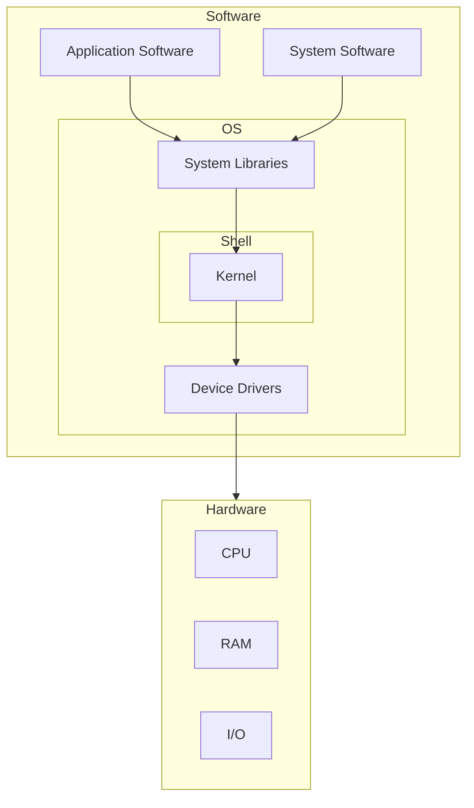

An Operating System (OS) is a/an:
- Interface between a computer user and computer hardware.
- Software that enables applications to interact with a computer's hardware.
	- The software that contains the core components of the operating system is called the **kernel**.

- The shell takes commands from the user and executes kernel's functions.