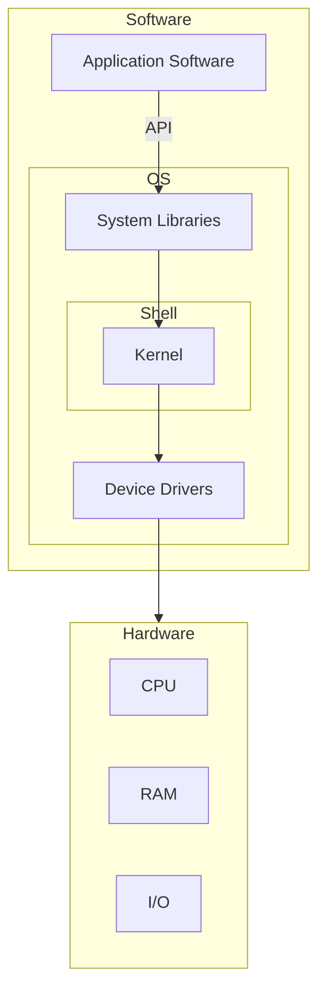

An Operating System (OS) is a/an:
- Interface between a computer user and computer hardware.
- Software that enables applications to interact with a computer's hardware.
	- The software that contains the core components of the operating system is called the **kernel**.

- Application Programming Interface or API is the interface that the OS provides to an application to interact with system libraries.
	 - The API term means a set of agreements for interacting components of the information system.
	 - Imagine API as a list of all available functions that the application can call.
- Both the OS and application should follow the API agreements. 
- System libraries are special functions or programs using which application programs or system utilities accesses Kernel's features.
- The shell takes commands from the user and executes kernel's functions.

OS kernel and device drivers are part of OS. They dictate which hardware features the
application can access. When the application interacts with system libraries, the libraries request
capabilities of kernel and drivers. If you need the hardware feature and OS does not support it, you
cannot use it.