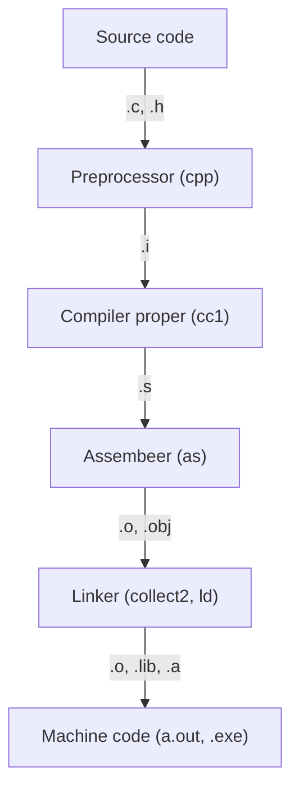

Compilation is the process of converting source code (human-readable code) into object code (machine-readable code). The actual program that runs in a [CPU](https://en.wikipedia.org/wiki/Central_processing_unit) consists of instructions in machine code: patterns of 0 and 1 stored in 14 bit chunks at different addresses.

The compilation process in C involves four steps:
1. [[preprocessor|Preprocessor]]: Remove comments, add code from headers and expand macros
2. [[compiler|Compiler]]: Generate [assembly code](https://en.wikipedia.org/wiki/Assembly_language).
	- This stage is often referred to as compilation proper.
3. [[Assembler]]: Generate object code (binary / [machine code](https://en.wikipedia.org/wiki/Machine_code)).
4. [[Linker]]: Link code from file(s) and libraries to generate an executable.

First, the C [[preprocessor]] (cpp) expands [[macros]] definitions and [[directives|include]] statements; the output of cpp is just C code. The cpp passes the result to the actual [[compiler]]. The [[compiler]] effectively translates preprocessed C code into assembly code, performing various optimizations along the way as well as [register allocation](https://en.wikipedia.org/wiki/Register_allocation#:~:text=In%20compiler%20optimization%2C%20register%20allocation,limited%20number%20of%20processor%20registers.). The compiler generates [assembly code](https://en.wikipedia.org/wiki/Assembly_language) specific to a [particular architecture](https://en.wikipedia.org/wiki/Computer_architecture). The assembly code generated by the compilation step is then passed to the [[assembler]] which translates it into machine code; the resulting file is called an object file. An object file is a binary representation of the program. A typical object file contains the program text (instructions) and data (constants and strings), information about instructions and data that depend on absolute addresses, a symbol table of unresolved references, and possibly some debugging information. The object file will be linked with other object files and libraries to produce a program. The [[linker]] produces a binary executable that can be run from the command interface.
