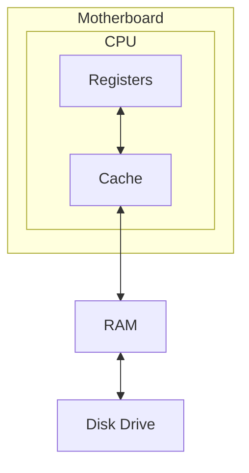
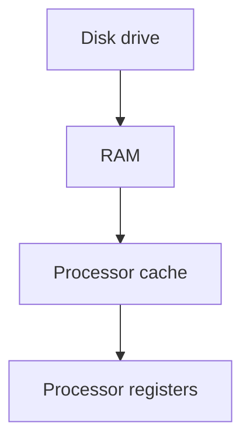

- A modern computer has four levels of the [memory hierarchy](https://en.wikipedia.org/wiki/Memory_hierarchy).

- The CPU chip contains two separate modules: registers and a memory cache.
- Data transfer occurs between adjacent memory levels.
- The CPU process data from its registers.
	- This is the only place where the processor can take data for calculations.
If the CPU needs data from the disk drive, the following data transfers happen:

