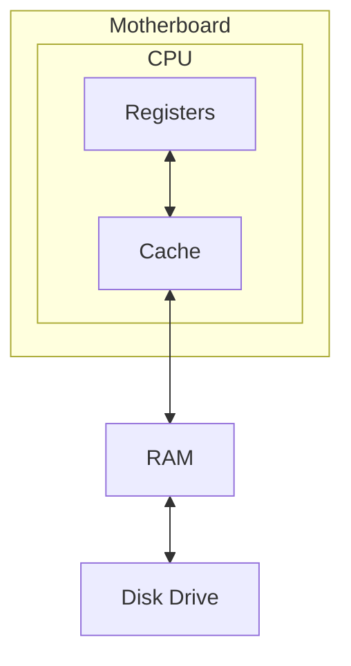

# Computer Program

A computer program is a set of instructions that has two forms:
- Human readable / Source code:  text written in a programming language
- Machine code: source code [[compilation|compiled]]
# RAM

- The first step of launching a program is to load it into Random-access memory (RAM).
	- It is called "random" because a program can call to a value stored in some memory address "randomly", that is, without having to access in a specific order (e.g. from top to bottom)
# byte

- The single unit of the computer memory is a byte.
- A byte is a memory block of eight bits.
- A bit is the smallest amount of information you cannot divide.
- CPU cannot refer to a single bit.
	- The reasons are historical.
		- The primary task of the first computers was arithmetic calculations and a single bit is not enough to store a number in memory.
		- So, the computer needs memory blocks to store numbers.

- Memory is a (list) sequence of locations (bytes) to store [[C/data types/types#value range|data values]].
- Storing locations (bytes) are assigned unique memory [[C/memory/address|addresses]].

The Stack and the Heap are two memory areas located in the computer’s RAM.

# Memory hierarchy

- A modern computer has four levels of the [memory hierarchy](https://en.wikipedia.org/wiki/Memory_hierarchy).

# CPU

- The Central Processing Unit (CPU) is basically a huge network of logic gates.
	- It is also known as a processor or microprocessor.
	- Inside a CPU there are thousands of microscopic transistors.
- The CPU chip contains two separate modules: registers and a memory cache.
- Data transfer occurs between adjacent memory levels.
- The CPU process data from its registers.
	- This is the only place where the processor can take data for calculations.

- The motherboard is the printed circuit board that connects computer components.

