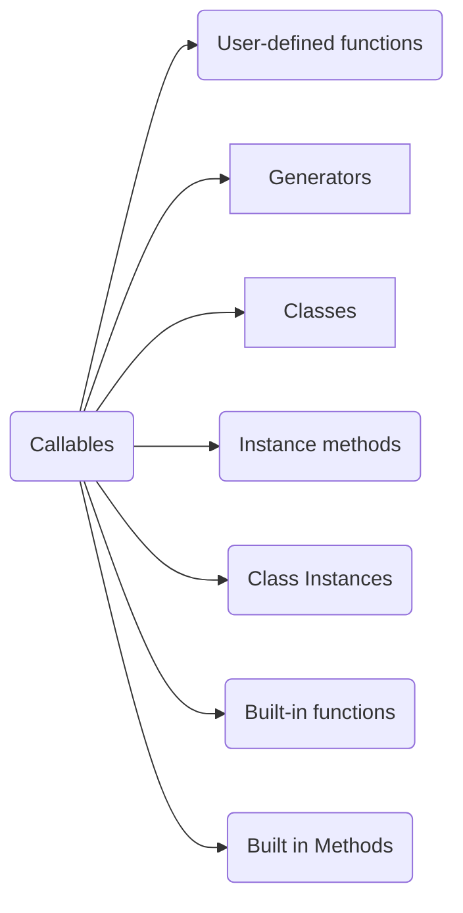

```mermaid
flowchart LR
N(Callables)
	N --> O(User-defined functions)
	N --> Generators
	N --> Classes
	N --> P(Instance methods)
	N --> Q(Class Instances)
	N --> R(Built-in functions)
	N --> S(Built in Methods)
```
