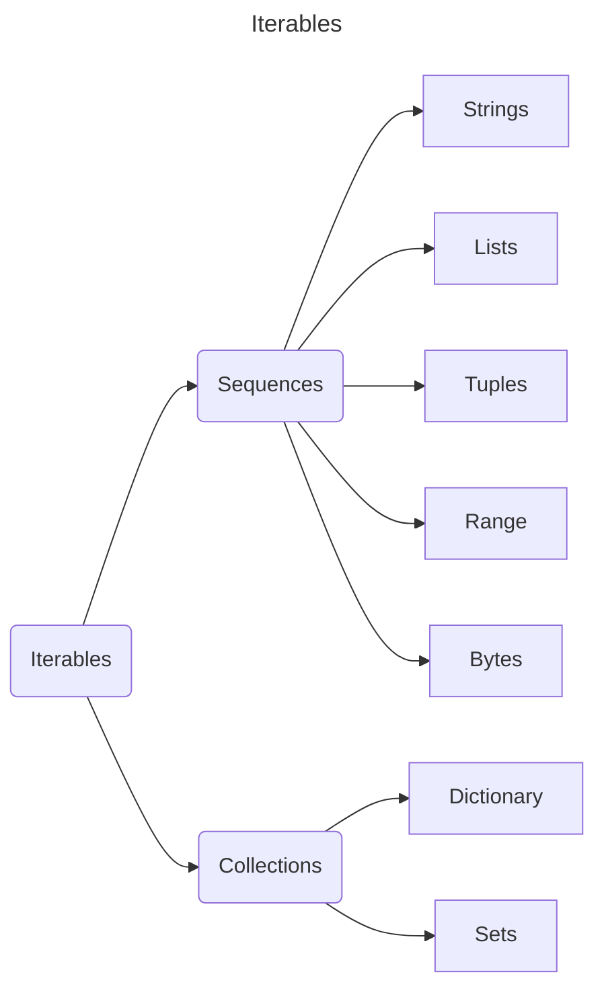

```mermaid
---
title: Iterables
---
flowchart LR
I(Iterables) --> S(Sequences)
	S --> Strings
	S --> Lists
	S --> Tuples
	S --> Range
	S --> Bytes
I(Iterables) --> C(Collections)
	C --> Dictionary
	C --> Sets

```

