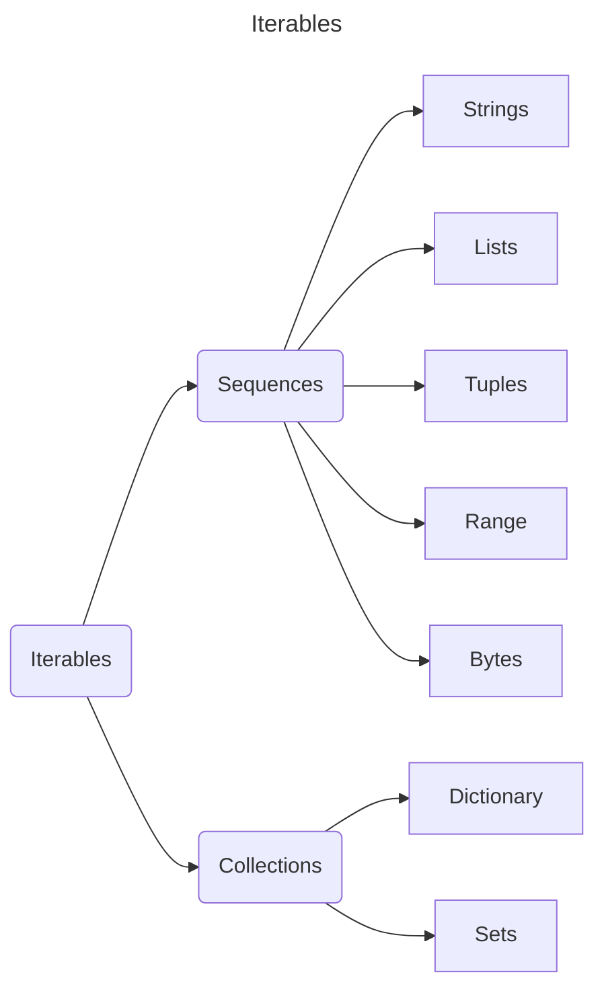

# Sequences

- A sequence is a positionally **ordered** collection of items.
- [[lists|Lists]], [[tuples|tuples]], and [[Python/data types/strings/strings|strings]] are sequences because things come out of them in the same order they were put in.


[Built-in Types — Python 3.12.0 documentation](https://docs.python.org/3/library/stdtypes.html#typesseq)

[Python Sequences](https://www.pythontutorial.net/advanced-python/python-sequences/)

[Python Programming/Sequences - Wikibooks, open books for an open world](https://en.wikibooks.org/wiki/Python_Programming/Sequences#Frozenset)

[Site Unreachable](https://www.w3schools.com/python/python_iterators.asp)

[Sololearn: Learn to Code](https://www.sololearn.com/en/Discuss/462454/difference-between-sequence-and-collection-in-python)

[Python Sequence and Collections - Operations, Functions, Methods - DataFlair](https://data-flair.training/blogs/python-sequence/)
# Collections
There are four collection data types in the Python programming language:

- [[lists|List]] is a collection which is **ordered** and **changeable**. Allows **duplicate** members.
- [[tuples|Tuple]] is a collection which is **ordered** and **unchangeable**. Allows **duplicate** members.
- [[sets|Set]] is a collection which is **unordered**, **unchangeable**, and **unindexed**. **No duplicate** members.
- [[dictionaries|Dictionary]] is a collection which is **ordered** and changeable. **No duplicate** members.


## Unpack a collection

If you have a collection of values, Python allows you to extract the values into variables. This is called unpacking.

```Python
fruits = ["apple", "banana", "cherry"]
x, y, z = fruits
print(x, y, z)
```

