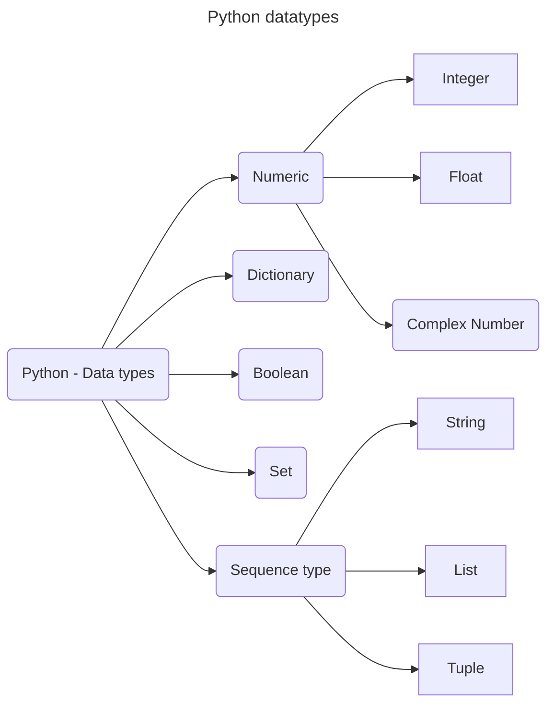

Python is a dynamically-typed language, which means we can assign any kind of data to any variable:

```Python
x = 4
x = "Four"
```



| Description     | Type                               |
| --------------- | ---------------------------------- |
| Text Type:      | `str`                              |
| Numeric Types:  | `int`, `float`, `complex`          |
| Sequence Types: | `list`, `tuple`, `range`           |
| Mapping Type:   | `dict`                             |
| Set Types:      | `set`, `frozenset`                 |
| Boolean Type:   | `bool`                             |
| Binary Types:   | `bytes`, `bytearray`, `memoryview` |
| None Type:      | `NoneType`                         |

You can get the data type of any object by using the `type()` function:

```Python
print(type("Hello World"))
print(type(20))
print(type(20.5))
print(type(1j))
print(type(["apple", "banana", "cherry"]))
print(type(("apple", "banana", "cherry")))
print(type(range(6)))
print(type({"name" : "John", "age" : 36}))
print(type({"apple", "banana", "cherry"}))
print(type(frozenset({"apple", "banana", "cherry"})))
print(type(True))
print(type(b"Hello"))
print(type(bytearray(5)))
print(type(memoryview(bytes(5))))
print(type(None))
```

