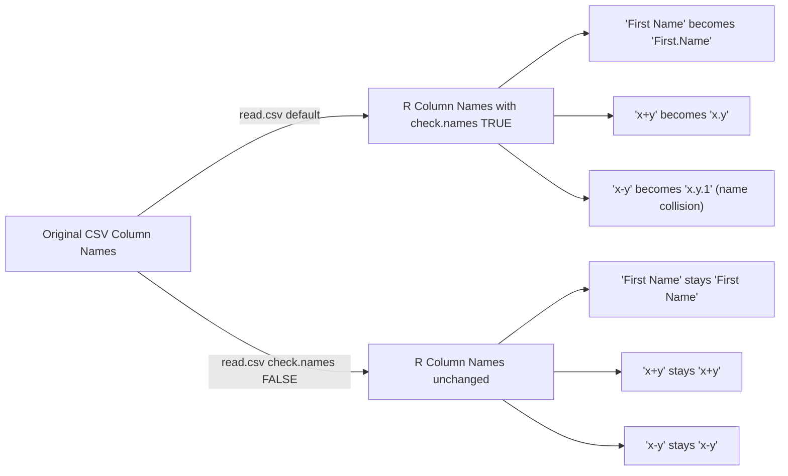

---

### R Data Import & Column Names

1. **Syntactic vs Non-syntactic Names**

   * *Syntactic names*: Valid R variable names (e.g., `age`, `height`)
   * *Non-syntactic names*: Names with spaces, symbols, or starting with numbers (e.g., `"First Name"`, `"x+y"`)

2. **Default Behavior of `read.csv()`**

   * By default, `read.csv()` uses `check.names = TRUE`
   * Automatically converts non-syntactic names to syntactic names using `make.names()`
   * Example: `"First Name"` → `"First.Name"`, `"x+y"` → `"x.y"`
   * **Problem:** This transformation is **non-invertible**; original names can be corrupted or lost

3. **Preserving Original Column Names**

   * Use `check.names = FALSE` when reading the data:

     ```r
     df <- read.csv("file.csv", check.names = FALSE)
     ```
   * Keeps column names exactly as they appear in the file
   * Trade-off: you may need backticks to reference columns with non-syntactic names

4. **Referencing Columns**

   * `$` operator:
     * Works with syntactic names: `df$age`
     * For non-syntactic names: use backticks ``df$`First Name` ``
   * `[[ ]]` operator:
     * Works with both syntactic and non-syntactic names: `df[["First Name"]]`

4. **Best Practice**
   * Don’t always set `check.names = FALSE`; first check your data’s column names
   * Use backticks or `[[ ]]` if column names contain spaces or symbols

---


